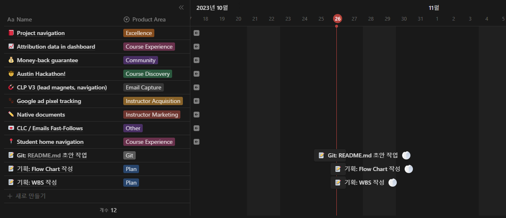

# 개발자 기술 블로그 최적화 Blog 서비스
## 목차
[1. 목표와 기능](#1-목표와-기능)  
[2. 개발 기술 및 환경, 배포 URL](#2-개발-기술-및-환경-배포-url)  
[3. 프로젝트 구조와 개발 일정](#3-프로젝트-구조와-개발-일정)
## 1. 목표와 기능
### 1-1. 목표
- 개발자들의 기술 Blog에 최적화된 Blog 플랫폼
- 전체 개발자 & 분야별 개발자 커뮤니티 제공 플랫폼  

### 1-2. 기능
- 기술 항목 태그를 통해 원하는 기술과 관련된 블로그 글을 확인할 수 있는 기능
- 분야에 따라 해당하는 게시판에서 소통할 수 있는 기능
#### [Flow Chart]
  

## 2. 개발 기술 및 환경, 배포 URL
### 2-1. 개발 기술
#### [기술 - FE]  

    
    
    
    

#### [기술 - BE]

    
    

#### [기술 - DB]

### 2-2. 개발 환경

    
    

### 2-3. 배포 URL
[배포 URL 추가 필요]

## 3. 프로젝트 구조와 개발 일정
### 3-1. 프로젝트 Directory 구조
[추후 추가 필요]  

### 3-2. 프로젝트 URL 구조
|URL 경로  |views 함수 이름  |html 파일이름   |비고 |
|:-------:|:--------------:|:------------:|:---:|
|'blog/'  |postlist        |post_list.html|     |
[추후 수정 필요]  

### 3-3. 개발 일정

[추후 변경 필요]
